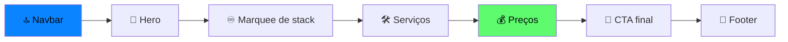

<div align="center">


<a href="https://github.com/DenverCoder1/readme-typing-svg">
  
</a>

<br/>


**Landing page premium, mobile-first, com glassmorphism, rede de partículas e planos em BRL.**

[✨ Efeitos](#-efeitos) · [💰 Planos](#-planos) · [💬 WhatsApp](#-links-do-whatsapp) · [📲 PWA](#-pwa) · [🚀 Executar](#-como-executar)

</div>

---

## 🗂️ Estrutura de arquivos

| Arquivo | Descrição |
|:--|:--|
| 📄 `index.html` | Página completa: HTML + Tailwind + CSS customizado + JavaScript |
| 🧾 `manifest.json` | Manifesto PWA (nome, cores, ícone, modo `standalone`) |
| ⚙️ `sw.js` | Service worker: cache `ek-v1`, *network-first* com fallback para cache |
| 🎨 `icon.svg` | Ícone do app (`</>` com gradiente azul → verde) |
| 📖 `README.md` | Esta documentação |

## 🧰 Tecnologias

- **HTML5 semântico** (`header`, `nav`, `main`, `section`, `article`, `footer`) com ARIA
- **Tailwind CSS** via CDN, com tema customizado (`neon`, `cyan2`, `ink`; fontes Inter e JetBrains Mono)
- **CSS3**: Grid, Flexbox, `backdrop-filter`, `mask-image`, `animation-timeline: scroll()`, View Transitions (`@view-transition`)
- **JavaScript ES6+** vanilla em uma IIFE com `'use strict'`
- **GSAP 3.12.5 + ScrollTrigger** via CDN

## 🧭 Seções da página



1. **Navbar** (`#nav`): logo, links âncora, botão WhatsApp e menu hambúrguer no mobile
2. **Hero** (`#top`): headline digitada, 2 CTAs, indicadores, janela de código animada e canvas de partículas
3. **Marquee** (`#stack`): faixa infinita de tecnologias
4. **Serviços** (`#servicos`): Automação com IA · MVP em 7 dias · Otimização de Código Legado
5. **Preços** (`#precos`): 3 cards com tilt 3D
6. **CTA final** (`#contato`) e **footer**

## 💰 Planos

| | Plano | Nome | Duração | Preço |
|:-:|:--|:--|:--|--:|
| 🔹 | Essential | Debug Express | Call de 30 min | **R$150** |
| ⭐ | Pro (mais popular) | Code Review & AI Boost | 60 min + relatório PDF | **R$300** |
| 💎 | Premium | MVP Sprint | Entrega em 7 dias | **R$1.500** |

## ✨ Efeitos

| Efeito | Classe / ID | Como funciona |
|:--|:--|:--|
| 🕸️ **Rede de partículas** | `#particles` | Canvas 2D com até 90 nós (proporcional à área). Nós próximos se ligam; mouse/toque vira um nó extra com linhas verdes. Pausa fora da tela (`IntersectionObserver`), DPR máx. 2 |
| ⌨️ **Digitação** | `#typed` | Escreve "Eu transformo ideias em SaaS com IA" com cursor piscando |
| 🎬 **Scroll reveal** | `.reveal` | GSAP ScrollTrigger (`top 88%`, uma vez), com fallback em `IntersectionObserver` |
| 📊 **Barra de progresso** | `#progress` | Animação CSS ligada ao scroll (`animation-timeline`), com *progressive enhancement* |
| 🧲 **Botão magnético** | `.magnetic` | Segue o cursor em ponteiro fino; no toque, escala ao pressionar |
| 💧 **Ripple** | `.ripple` | Onda ao clicar/tocar em qualquer `.btn` |
| 🃏 **Tilt 3D + glow** | `.tilt` | Inclinação 3D e brilho radial que seguem o ponteiro (`--mx`, `--my`) |
| 🪟 **Navbar liquid glass** | `.scrolled` | Após 20px de scroll aplica blur, saturação e brilho interno |
| ♾️ **Marquee** | `#marqueeTrack` | Lista duplicada animada com `translateX`; pausa no hover |
| 💻 **Janela de código** | `.code-line` | Linhas aparecem em sequência simulando geração por IA |

> ♿ Respeita `prefers-reduced-motion`, usa alvos de toque ≥ 48 px e atributos `aria-*` nos controles.

## 💬 Links do WhatsApp

Todos os CTAs usam `https://wa.me/5517992634306?text=<mensagem codificada>` com `target="_blank"` e `rel="noopener noreferrer"`. O `wa.me` abre o app no celular e o WhatsApp Web/Desktop no computador.

| Botão | Mensagem |
|:--|:--|
| Navbar · Falar no WhatsApp | Olá Eric! Vim pelo site. |
| Hero · Ver planos e preços → | Olá Eric! Quero conhecer os planos e preços. |
| Hero · Falar no WhatsApp | Olá Eric! Vim pelo site e quero conversar sobre um projeto. |
| Debug Express | Olá Eric! Quero agendar o Debug Express de R$150. Meu bug/problema é: |
| Code Review & AI Boost | Olá Eric! Quero o Code Review & AI Boost de R$300. Meu projeto é: |
| MVP Sprint | Olá Eric! Quero o MVP Sprint de R$1.500. Minha ideia de SaaS é: |
| CTA final | Olá Eric! |

<details>
<summary>🔧 Como alterar número ou mensagens</summary>

Substitua `5517992634306` em `index.html` para trocar o número. Para mudar as mensagens, edite o parâmetro `text` (com URL encoding).

</details>

## 📲 PWA

- `manifest.json` define o app como `standalone` com `start_url` `./index.html`
- `sw.js` só é registrado em `http(s)` (não funciona via `file://`)
- Ao mudar os arquivos em cache, incremente `CACHE` em `sw.js`

## 🚀 Como executar

```bash
# Opção 1: abrir index.html direto no navegador
# Opção 2: servidor local (necessário para testar o PWA)
npx serve .
```

## 🎛️ Personalização rápida

| O quê | Onde |
|:--|:--|
| 🎨 Cores | `tailwind.config` no `<head>` e gradientes no `<style>` |
| ♾️ Stack do marquee | array `stack` no script |
| ⌨️ Texto digitado | constante `text` no script |
| 💰 Planos | seção `#precos` em `index.html` |

## ⚠️ Notas para produção

- Tailwind via CDN é só para desenvolvimento: compile com o Tailwind CLI antes de publicar.
- O site depende de CDNs (Tailwind, GSAP, Google Fonts); considere hospedar localmente.
- Para melhor compatibilidade PWA, adicione ícones PNG de 192×192 e 512×512 ao manifesto.

---

<div align="center">

**Feito com 💙 IA e ☕ por Eric Koga**

[](https://wa.me/5517992634306)


</div>
